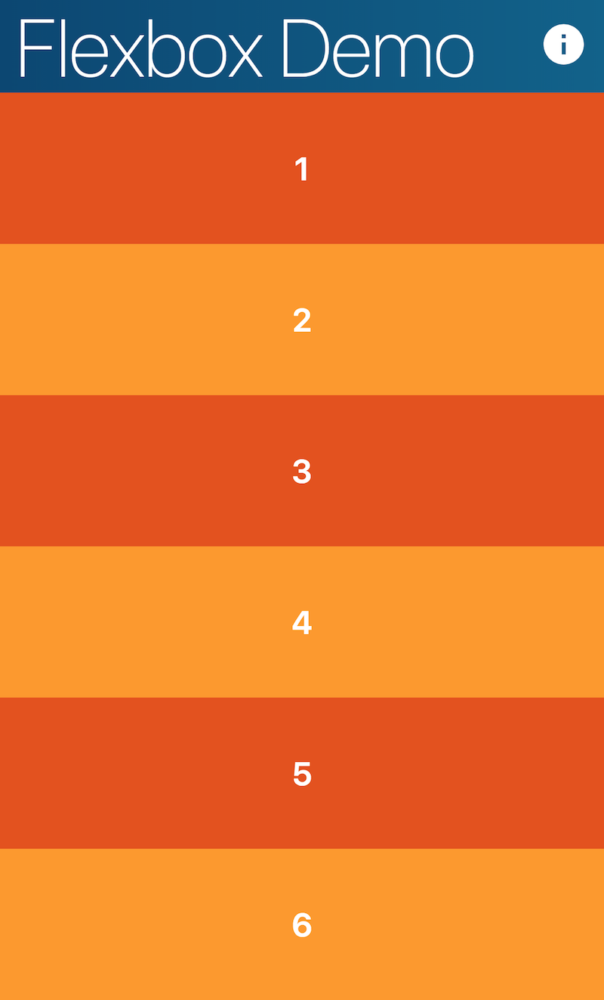
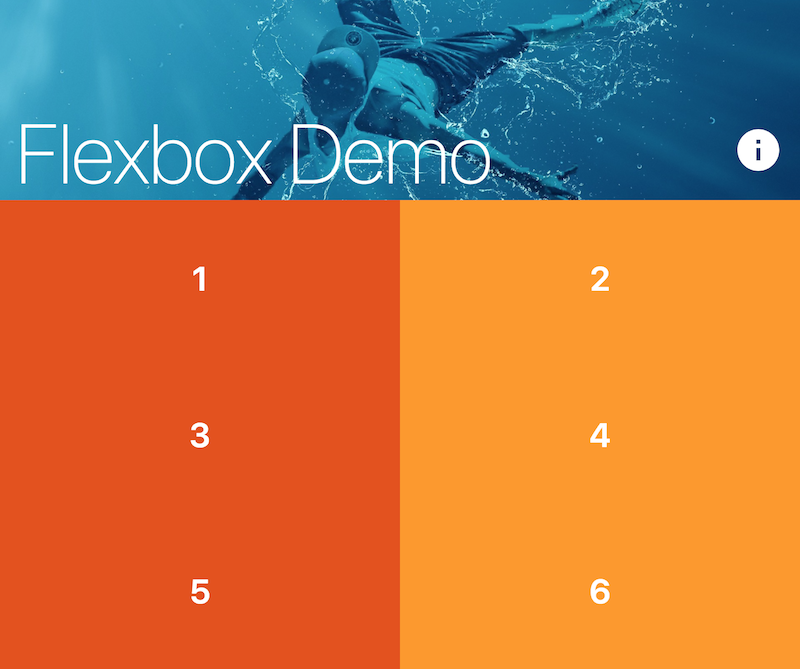
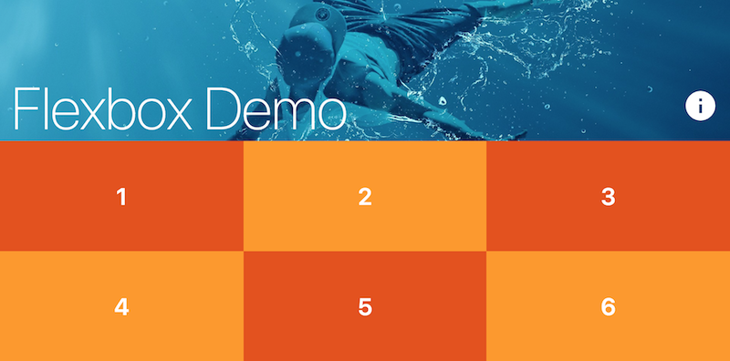
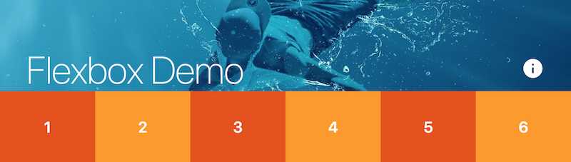

# Responsive CSS Exercise

During our last class you learned how to create [multi-column layouts using Flexbox](https://drstearns.github.io/tutorials/flexbox/). Now you will extend that exercise by making the multi-column layout [responsive to the screen width](https://drstearns.github.io/tutorials/responsive/).

The `css/index.css` file already has the rules we coded together during our last class. It also has some `TODO:` comments at the end describing what you need to add to make your layout responsive. Your goal is to add rules according to those comments such that your page looks like the following screenshots at the different screen widths.

- [Multi-Column Layouts with Flexbox Tutorial](https://drstearns.github.io/tutorials/flexbox/)
- [Complete Guide to CSS Flexbox](https://css-tricks.com/snippets/css/a-guide-to-flexbox/)
- [Responsive CSS Tutorial](https://drstearns.github.io/tutorials/responsive/)

## Less than 768px

## 768px to 991px

## 992px to 1199px

## Wider than 1200px

