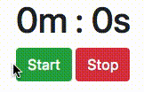

# Timer Practice Exercise

Your goal is to add the JavaScript necessary to make the page behave as you see in this animated GIF:

See the comments in the `js/index.js` file for details about how to implement this.

When testing your implementation, **keep your Developer Tools Console tab open** so that you see any runtime errors that occur. If you see a runtime error, the exact line number where the error occurred will be shown to the right. Use the debugger if you need to examine variable values or trace through your logic.

For an extra challenge, add a **Resume** button that is similar to the **Start** button, but does not reset the timer back to zero. Instead, it should resume counting seconds/minutes from where the timer left off. To make this work, you'll have to store an extra key/value in the application state when the Stop button is clicked.
